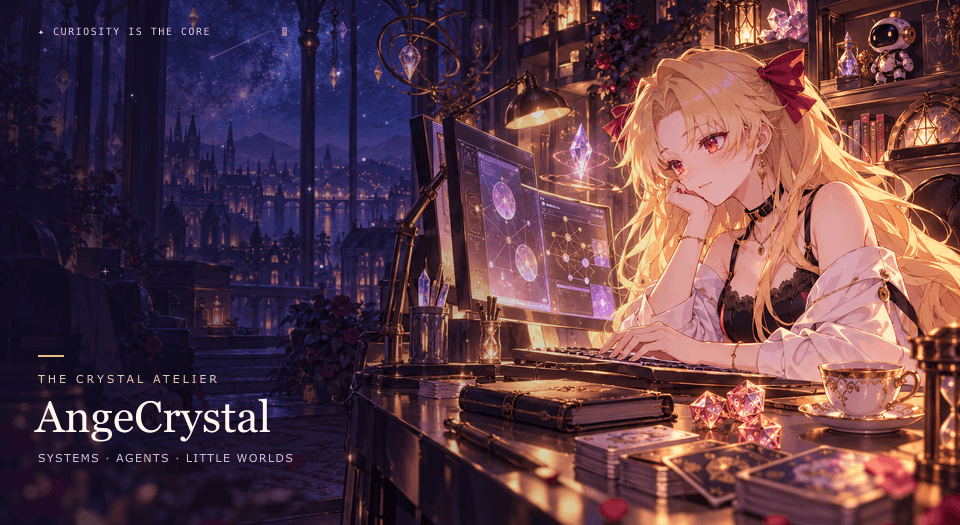

  <picture>
    <source media="(prefers-reduced-motion: reduce)" srcset="assets/crystal-atelier.png">
    
  </picture>

<h1 align="center">Hi, I'm AngeCrystal ✦</h1>

  <strong>From operating systems to intelligent agents — curiosity all the way down.</strong> 
  A little code, a little imagination, and worlds waiting to be explored.

  <a href="README.md">简体中文</a> &nbsp; / &nbsp; <a href="README.en.md">English</a>
  &nbsp; · &nbsp; <a href="https://github.com/AngeCrystal?tab=repositories">Repositories ↗</a>

  
  
  
  

---

### ✦ Behind the screen

I'm **AngeCrystal**. I like asking *why* technology works, and finding new possibilities between code, stories, and games.

My interests include **operating systems, systems engineering, AI, and agents**: how programs run, how systems work together, and how agents use tools to get things done. This is a home for my explorations and small, curiosity-driven projects.

### ⌘ Current orbit

| Direction | Questions to explore |
| :--- | :--- |
| **OS & Systems** | Beneath the abstractions: processes, memory, concurrency, and system design. |
| **Agents & AI** | From models to action: tool use, execution feedback, and reliable workflows. |
| **Build & Experiment** | Understanding big ideas through small, working projects. |

### ◈ Things I'm building

| Project | About |
| :--- | :--- |
| [**patchpilot ↗**](https://github.com/AngeCrystal/patchpilot) | A Python coding-agent demo exploring host-computed diffs, explicit approval, and bounded execution feedback. |
| [**mini-renderer ↗**](https://github.com/AngeCrystal/mini-renderer) | A small C++ / OpenGL renderer for learning the real-time graphics pipeline. |

### ♧ Side quests

**🎲 Board games** &nbsp; Rules, strategy, and good company around a table.  
**🌸 Anime** &nbsp; Stories and worlds worth getting lost in.  
**✧ Anime games** &nbsp; Characters, art, music, and a sense of adventure.  
**🔭 Technology** &nbsp; Staying curious about new ideas and how they work.

 

  
   <samp>Stay curious. Build little worlds.</samp>
   Let's talk systems, AI, or what to play next.

